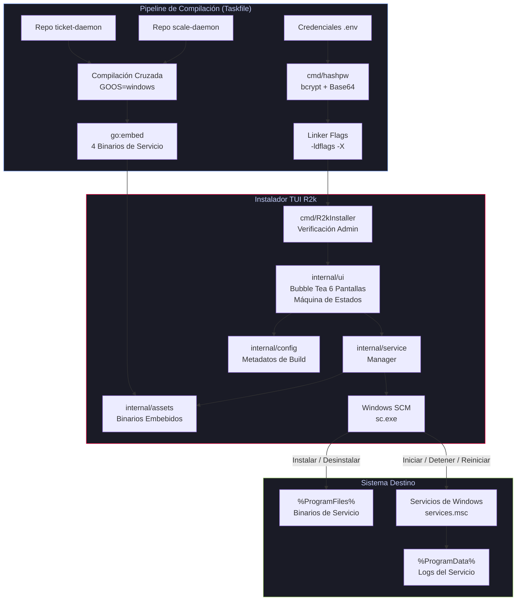

# R2k Service Family Manager

**Instalador TUI interactivo y autocontenido para gestionar el ciclo de vida de servicios Windows POS — instala,
monitorea y controla los servicios de Báscula y Tickets desde una única aplicación de terminal.**


---

## Arquitectura



## Características

- **TUI Interactiva** — Interfaz completa en terminal con navegación por teclado, spinners, barras de progreso y ayuda
  contextual, construida con Bubble Tea de Charm
- **Instalador Autocontenido** — Cuatro ejecutables de servicios Windows embebidos en tiempo de compilación vía
  `go:embed` en un solo binario portable de ~15–20 MB
- **Ciclo de Vida Completo** — Instalar, iniciar, detener, reiniciar y desinstalar servicios de Windows directamente
  desde la terminal usando `sc.exe`
- **Exclusividad Mutua** — Solo una variante (Local **o** Remoto) de cada familia de servicios puede estar instalada a
  la vez
- **Monitoreo en Tiempo Real** — Sondeo en segundo plano cada 5 segundos que actualiza automáticamente el estado de los
  servicios en todas las pantallas
- **Credenciales Seguras** — Las contraseñas se hashean con bcrypt y se codifican en Base64 durante la compilación; el
  texto plano nunca llega al binario
- **Gestión de Logs** — Abre los logs del servicio en Notepad o navega a la carpeta de logs en Explorer directamente
  desde la TUI
- **Recuperación Automática** — Los servicios se configuran con `sc failure` para reiniciarse automáticamente ante
  fallos

---

## Primeros Pasos

### Prerrequisitos

| Herramienta    | Versión    | Instalación                                                     |
|----------------|------------|-----------------------------------------------------------------|
| **Windows**    | 10/11      | —                                                               |
| **Go**         | 1.25+      | [go.dev/dl](https://go.dev/dl/)                                 |
| **Task**       | 3.x        | [taskfile.dev/installation](https://taskfile.dev/installation/) |
| **Git**        | Cualquiera | [git-scm.com](https://git-scm.com/)                             |
| **PowerShell** | 5.1+       | Viene incluido en Windows                                       |

### Paso 1 — Clonar los repositorios

Los tres repositorios deben quedar como **carpetas hermanas** (al mismo nivel). El Taskfile referencia `../scale-daemon`
y `../ticket-daemon` de forma relativa.

```powershell
mkdir C:\dev\r2k
cd C:\dev\r2k

git clone https://github.com/adcondev/poster-tuis.git
git clone https://github.com/adcondev/scale-daemon.git
git clone https://github.com/adcondev/ticket-daemon.git
```

Resultado esperado:

```
C:\dev\r2k\
├── poster-tuis\        ← Este proyecto (instalador TUI)
├── scale-daemon\       ← Servicio de báscula
└── ticket-daemon\      ← Servicio de tickets
```

### Paso 2 — Configurar el archivo `.env`

El Taskfile necesita un archivo `.env` en la raíz de `poster-tuis` para hashear e inyectar las credenciales de forma
segura.

```powershell
cd poster-tuis
copy .env.example .env
```

Edita el `.env` con tus valores. Ejemplo:

```env
SCALE_DASHBOARD_PASSWORD=mi_contraseña_scale
SCALE_AUTH_TOKEN=mi_token_secreto
SCALE_PORT=8765

TICKET_DASHBOARD_PASSWORD=mi_contraseña_ticket
TICKET_AUTH_TOKEN=mi_token_secreto
TICKET_PORT=8766
```

### Paso 3 — Inicializar los módulos de Go

```powershell
cd C:\dev\r2k\poster-tuis
go mod tidy

cd C:\dev\r2k\scale-daemon
go mod tidy

cd C:\dev\r2k\ticket-daemon
go mod tidy
```

### Paso 4 — Compilar el instalador

Desde la carpeta `poster-tuis`, elige una de las dos opciones:

**Opción A — Un solo comando (recomendada):**

```powershell
cd C:\dev\r2k\poster-tuis
task build:rebuild
```

Esto ejecuta automáticamente: limpieza → compilación de los 4 servicios → compilación del instalador TUI.

**Opción B — Paso a paso (para depuración):**

```powershell
cd C:\dev\r2k\poster-tuis

# 1. Limpiar artefactos anteriores
task setup:clean:all

# 2. Compilar los 4 binarios de servicio (.exe)
#    Se colocan en internal/assets/bin/ para ser embebidos
task build:services

# 3. Compilar el instalador TUI
#    Embebe los 4 binarios y genera dist/R2k_POS_Instalador.exe
task build:installer
```

**Verificar que la compilación fue exitosa:**

```powershell
# El archivo debe existir y pesar entre 15-20 MB (contiene 4 binarios embebidos)
(Get-Item .\dist\R2k_POS_Instalador.exe).Length / 1MB
```

### Paso 5 — Ejecutar el instalador

> **⚠️ Se requieren privilegios de Administrador** — El instalador usa `sc.exe` para registrar y controlar servicios de
> Windows.

```powershell
# Abrir PowerShell como Administrador, luego:
cd C:\dev\r2k\poster-tuis
.\dist\R2k_POS_Instalador.exe
```

**Controles de teclado:**

| Tecla       | Acción                       |
|-------------|------------------------------|
| `↑` / `k`   | Navegar arriba               |
| `↓` / `j`   | Navegar abajo                |
| `Enter`     | Seleccionar                  |
| `r`         | Reinicio rápido del servicio |
| `?`         | Mostrar/ocultar ayuda        |
| `ESC` / `q` | Volver / Salir               |

---

## Sistema de Tareas (Taskfile)

Este proyecto usa [Task](https://taskfile.dev/) como ejecutor de tareas (similar a Make, pero escrito en YAML). El
archivo `Taskfile.yml` principal importa tres módulos especializados:

```
Taskfile.yml              ← Orquestador principal (variables, ldflags, .env)
├── taskfiles/
│   ├── build.yml         ← Compilación de servicios e instalador
│   ├── setup.yml         ← Creación de directorios y archivos temporales
│   └── ci.yml            ← Linting, pruebas unitarias y benchmarks
```

Para ver todas las tareas disponibles: `task list`

### 🏗️ Compilación (`build:`)

| Comando                | Qué hace                                                                  |
|------------------------|---------------------------------------------------------------------------|
| `task build:services`  | Compila los 4 binarios de servicio y los coloca en `internal/assets/bin/` |
| `task build:installer` | Embebe los 4 binarios y genera `dist/R2k_POS_Instalador.exe`              |
| `task build:rebuild`   | Limpia todo y recompila desde cero (limpieza + servicios + instalador)    |

### 🛠️ Preparación (`setup:`)

| Comando                | Qué hace                                                                |
|------------------------|-------------------------------------------------------------------------|
| `task setup:init:all`  | Crea los directorios necesarios y genera archivos dummy para `go:embed` |
| `task setup:clean:all` | Elimina `internal/assets/bin/` y `dist/`                                |

> **💡 ¿Qué son los archivos dummy?** El paquete `assets` usa directivas `//go:embed` que necesitan que los archivos
`.exe` existan en disco para que `go build` y el linter funcionen correctamente. Los dummies son archivos de texto plano
> temporales que satisfacen ese requisito durante el desarrollo, antes de la compilación real.

### 🔍 Calidad de Código (`ci:`)

| Comando              | Qué hace                                                                   |
|----------------------|----------------------------------------------------------------------------|
| `task ci:linter`     | Ejecuta `golangci-lint` con 15+ reglas de análisis estático                |
| `task ci:test`       | Ejecuta las pruebas unitarias con reporte de cobertura                     |
| `task ci:benchmark`  | Ejecuta benchmarks de rendimiento                                          |
| `task ci:debug:auth` | Muestra el flujo completo de hashing de contraseñas (útil para depuración) |

### ¿Cómo funciona el pipeline de compilación?

El proceso completo que ocurre al ejecutar `task build:rebuild`:

1. **Limpieza** — Elimina los directorios `internal/assets/bin/` y `dist/` para empezar desde cero
2. **Lectura de `.env`** — Taskfile carga automáticamente las variables del archivo `.env` (contraseñas, tokens,
   puertos)
3. **Hashing de contraseñas** — Ejecuta `cmd/hashpw` para generar hashes bcrypt codificados en Base64 a partir de las
   contraseñas
4. **Compilación cruzada** — Compila los 4 servicios desde los repos hermanos (`../scale-daemon`, `../ticket-daemon`)
   con `GOOS=windows GOARCH=amd64`
5. **Inyección de configuración** — Usa `-ldflags -X` para inyectar en cada binario: fecha de compilación, hash de
   contraseña, token, puerto e ID de servicio
6. **Embebido** — Los 4 archivos `.exe` resultantes se colocan en `internal/assets/bin/`, donde las directivas
   `go:embed` los integran al instalador
7. **Compilación final** — Se genera `dist/R2k_POS_Instalador.exe` (~15–20 MB), un solo archivo que contiene todo lo
   necesario

---

## Estructura del Proyecto

```
poster-tuis/
├── cmd/
│   ├── R2kInstaller/           # Punto de entrada de la TUI (verificación admin + tea.NewProgram)
│   └── hashpw/                 # Utilidad para generar hashes bcrypt en tiempo de compilación
├── internal/
│   ├── assets/                 # Directivas go:embed para los 4 binarios de servicio
│   ├── config/                 # Metadatos de compilación y banner (inyectados vía ldflags)
│   ├── service/                # Integración con el Administrador de Servicios de Windows (sc.exe)
│   └── ui/                     # Interfaz TUI con Bubble Tea (6 pantallas, estilos, teclas)
├── taskfiles/                  # Tareas modulares de compilación (build, setup, ci)
├── .github/workflows/          # CI, CodeQL, automatización de PRs, dashboard de estado
├── Taskfile.yml                # Orquestador principal de compilación
└── .golangci.yml               # Configuración del linter (15+ reglas de análisis)
```

## Contribuir

1. Haz un fork del repositorio
2. Crea una rama siguiendo Conventional Commits (`feat(ui): agregar nueva pantalla`)
3. Verifica que pasen `task ci:linter` y `task ci:test`
4. Envía un Pull Request — el CI validará automáticamente el título, ejecutará tests, linting y benchmarks

## Licencia

Este proyecto está bajo la [Licencia MIT](LICENSE) — © 2026 Adrián Constante.
